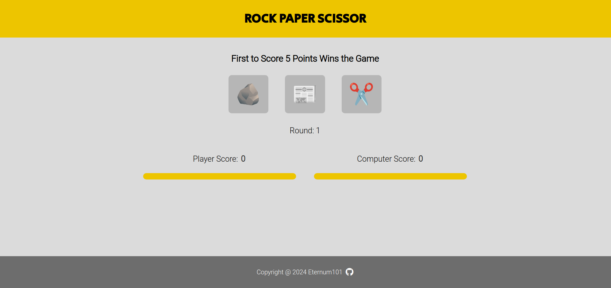
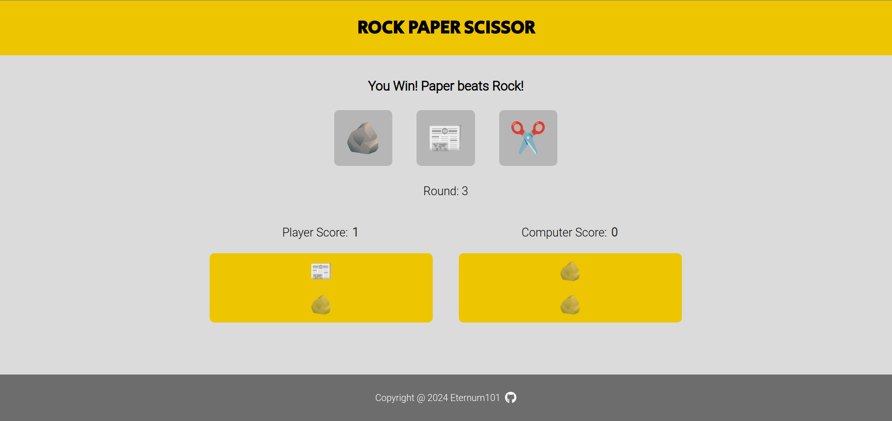
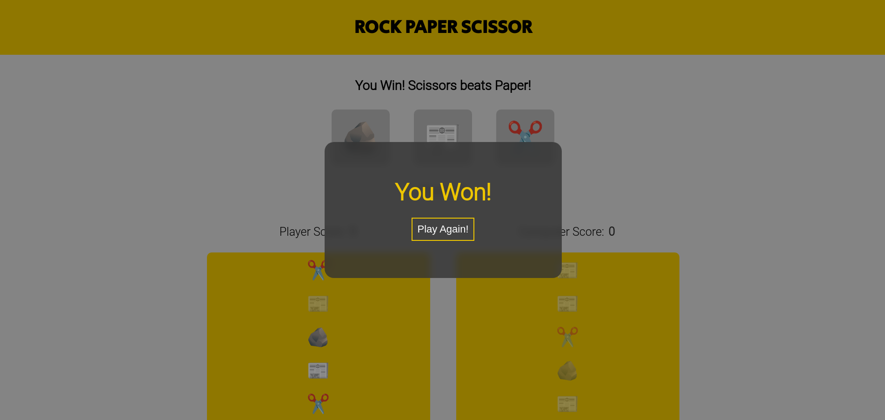
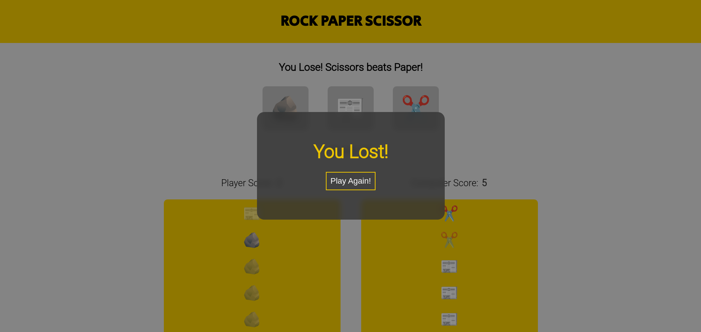

# Rock Paper Scissors

🔗 [View Demo](https://eternum101.github.io/rock-paper-scissors/)

## Table of Contents
- [About The Project](#about-the-project)
- [Built With](#built-with)
- [Screenshots](#screenshots)
- [Features](#features)

## About The Project
A implementation of the famous game "rock paper scissors".

## Screenshots

### Starting Screen

### Playing Screen

### Winning Screen

### Losing Screen

[Back to Top](#rock-paper-scissors)

## Built With

[Back to Top](#rock-paper-scissors)

## Features
- Round & Point System
- Shows History of Match
- Announces Winner at End of Match
- Displays Results for Each Round

[Back to Top](#rock-paper-scissors)

